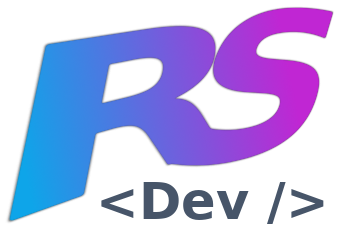

<a name="readme-top"></a>

<div align="center">

  
  <br/>

  <h3><b>Marvelous Web App</b></h3>

</div>

<!-- TABLE OF CONTENTS -->

# 📗 Table of Contents

- [📖 About the Project](#about-project)
  - [🛠 Built With](#built-with)
    - [Tech Stack](#tech-stack)
    - [Key Features](#key-features)
  - [🚀 Live Demo](#live-demo)
- [💻 Getting Started](#getting-started)
  - [Setup](#setup)
  - [Prerequisites](#prerequisites)
  - [Install](#install)
  - [Usage](#usage)
  - [Run tests](#run-tests)
  - [Deployment](#triangular_flag_on_post-deployment)
- [👥 Authors](#authors)
- [🔭 Future Features](#future-features)
- [🤝 Contributing](#contributing)
- [⭐️ Show your support](#support)
- [🙏 Acknowledgements](#acknowledgements)
- [❓ FAQ](#faq)
- [📝 License](#license)

<!-- PROJECT DESCRIPTION -->

# 📖 Marvelous <a name="about-project"></a>

**Marvelous** is a web app that allows users to search for Marvel characters and comics. It uses the Marvel API to fetch data and display it to the user. The app is built with Ruby on Rails

## 🛠 Built With <a name="built-with"></a>

### Tech Stack <a name="tech-stack"></a>

<details>
  <summary>Client</summary>
  <ul>
    <li>TailwindCSS</li>
    <li>Hotwire Turbo</li>
    <li>Hotwire Stimulus</li>
  </ul>
</details>

<details>
  <summary>Server</summary>
  <ul>
    <li>Ruby on Rails</li>
  </ul>
</details>

### Key Features <a name="key-features"></a>

- **Fetches up-to-date data from Marvel API**
- **HTML over-the-wire with Turbo**
- **Allows searching for a speciic comic**

<p align="right">(<a href="#readme-top">back to top</a>)</p>

<!-- LIVE DEMO -->

## 🚀 Live Demo <a name="live-demo"></a>


- TBA

<p align="right">(<a href="#readme-top">back to top</a>)</p>

<!-- GETTING STARTED -->

## 💻 Getting Started <a name="getting-started"></a>

To get a local copy up and running, follow these steps.

### Prerequisites

In order to run this project you need:

- Ruby installed in your machine

### Setup

Clone this repository to your desired folder:

```sh
  git clone git@github.com:rskinnerc/marvelous.git
```

### Install

Install this project with:

```sh
  cd marvelous
  bundle install
```

### Usage

To run the project, execute the following command:

```sh
  rails server
```

### Run tests

To run tests, run the following command:

```sh
  rspec
```

### Deployment

You can deploy this project using your favorite service

<p align="right">(<a href="#readme-top">back to top</a>)</p>

<!-- AUTHORS -->

## 👥 Authors <a name="authors"></a>


👤 **Ronald SKinner**

- GitHub: [@rskinnerc](https://github.com/rskinnerc)
- Twitter: [@XSkinner](https://twitter.com/XSKinner)
- LinkedIn: [LinkedIn](https://linkedin.com/in/rskinnerc)


<p align="right">(<a href="#readme-top">back to top</a>)</p>

<!-- FUTURE FEATURES -->

## 🔭 Future Features <a name="future-features"></a>


- **Implement liking comics**
- **Add authentication**
- **Implement comments per comic**

<p align="right">(<a href="#readme-top">back to top</a>)</p>

<!-- CONTRIBUTING -->

## 🤝 Contributing <a name="contributing"></a>

Contributions, issues, and feature requests are welcome!

Feel free to check the [issues page](../../issues/).

<p align="right">(<a href="#readme-top">back to top</a>)</p>

<!-- SUPPORT -->

## ⭐️ Show your support <a name="support"></a>

> Write a message to encourage readers to support your project

If you like this project...

<p align="right">(<a href="#readme-top">back to top</a>)</p>

<!-- ACKNOWLEDGEMENTS -->

## 🙏 Acknowledgments <a name="acknowledgements"></a>

> Give credit to everyone who inspired your codebase.

I would like to thank Kelvin for his time mentoring me through this project.

<p align="right">(<a href="#readme-top">back to top</a>)</p>

<p align="right">(<a href="#readme-top">back to top</a>)</p>

<!-- LICENSE -->

## 📝 License <a name="license"></a>

This project is [MIT](./MIT.md) licensed.


<p align="right">(<a href="#readme-top">back to top</a>)</p>
